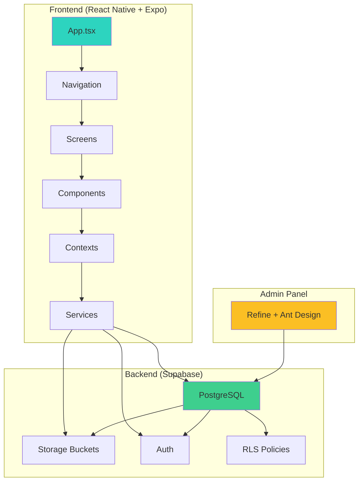

# 🤖 Plan de Acción Ejecutable: Sincronización de Documentación v2.10.0

**Proyecto:** Paziify  
**Versión:** 2.10.0  
**Fecha:** 16 de Febrero de 2026  
**Objetivo:** Sincronizar Código = Git = Documentación (100%)  
**Estado Actual:** 87% de coherencia

---

## 📋 Contexto para IA

Este documento contiene instrucciones ejecutables para actualizar la documentación del proyecto Paziify. Cada tarea incluye:
- ✅ Archivos específicos a modificar (rutas absolutas)
- ✅ Contenido exacto a añadir/modificar
- ✅ Comandos Git para ejecutar
- ✅ Criterios de verificación

**IMPORTANTE:** Sigue las instrucciones en orden. Cada sección tiene prioridad asignada.

---

## 🎯 Resumen de Hallazgos

### Código Real (Verificado)
- 25 pantallas
- 37 componentes
- 11 servicios
- 2 contextos
- 1 hook real (no 6 como documenta structure.md)

### Discrepancias Principales
1. **6 pantallas** NO documentadas en `structure.md`
2. **2 servicios** NO documentados completamente
3. **5 hooks** documentados pero NO existen en el código
4. **1 componente** (`SkiaDynamicText`) documentado pero NO existe
5. **`structure.md`** NO está en Git (archivo nuevo sin commit)
6. **6 archivos** de documentación modificados sin commit

---

## 🔴 PRIORIDAD URGENTE

### Tarea 1: Commit de Documentación Pendiente

**Objetivo:** Sincronizar Git con cambios locales de documentación

**Archivos Afectados:**
```
c:\Mis Cosas\Proyectos\Paziify\docs\guides\structure.md (NUEVO)
c:\Mis Cosas\Proyectos\Paziify\docs\guides\user_manual.md (MODIFICADO)
c:\Mis Cosas\Proyectos\Paziify\docs\guides\designs.md (MODIFICADO)
c:\Mis Cosas\Proyectos\Paziify\docs\guides\database.md (MODIFICADO)
c:\Mis Cosas\Proyectos\Paziify\docs\guides\audio.md (MODIFICADO)
c:\Mis Cosas\Proyectos\Paziify\.agent\workflows\catch-up.md (MODIFICADO)
c:\Mis Cosas\Proyectos\Paziify\.agent\workflows\session-end.md (MODIFICADO)
```

**Comandos a Ejecutar:**
```bash
cd "c:\Mis Cosas\Proyectos\Paziify"

# Añadir archivos al staging
git add docs/guides/structure.md
git add docs/guides/user_manual.md
git add docs/guides/designs.md
git add docs/guides/database.md
git add docs/guides/audio.md
git add .agent/workflows/catch-up.md
git add .agent/workflows/session-end.md

# Commit
git commit -m "docs: sync all guides to v2.10.0 + add structure.md as 5th pillar"

# Push
git push origin master
```

**Verificación:**
```bash
git status  # Debe mostrar "working tree clean"
git log -1  # Debe mostrar el commit recién creado
```

---

### Tarea 2: Actualizar README.md (5 Pilares)

**Archivo:** `c:\Mis Cosas\Proyectos\Paziify\README.md`

**Problema:** README menciona 4 pilares de documentación, pero ahora son 5 (falta `structure.md`)

**Ubicación del Cambio:** Línea 36

**Contenido Actual:**
```markdown
Paziify se rige por 4 pilares de documentación que deben estar siempre sincronizados:

- **[Audio & Voces](docs/guides/audio.md)**: Parámetros de identidad (Gaia, Aria, Ziro, Éter), motor de síntesis SSML y auditoría de las 101 sesiones.
- **[Diseño Visual (Oasis)](docs/guides/designs.md)**: Principios de diseño, orbes Skia, tipografía Oswald y jerarquía de imágenes (Admin > Local).
- **[Base de Datos & Seguridad](docs/guides/database.md)**: Esquema de Supabase, diccionarios de datos y políticas RLS.
- **[Manual de Usuario](docs/guides/user_manual.md)**: Guía de funcionalidades y manual del Panel Admin/CMS.
```

**Contenido Nuevo:**
```markdown
Paziify se rige por 5 pilares de documentación que deben estar siempre sincronizados:

- **[Estructura del Proyecto](docs/guides/structure.md)**: Mapa completo de pantallas, componentes, servicios, navegación y arquitectura técnica.
- **[Audio & Voces](docs/guides/audio.md)**: Parámetros de identidad (Gaia, Aria, Ziro, Éter), motor de síntesis SSML y auditoría de las 101 sesiones.
- **[Diseño Visual (Oasis)](docs/guides/designs.md)**: Principios de diseño, orbes Skia, tipografía Oswald y jerarquía de imágenes (Admin > Local).
- **[Base de Datos & Seguridad](docs/guides/database.md)**: Esquema de Supabase, diccionarios de datos y políticas RLS.
- **[Manual de Usuario](docs/guides/user_manual.md)**: Guía de funcionalidades y manual del Panel Admin/CMS.
```

**Instrucciones para IA:**
1. Abrir `c:\Mis Cosas\Proyectos\Paziify\README.md`
2. Localizar línea 36 (sección "## 📚 Documentación Maestra")
3. Reemplazar "4 pilares" por "5 pilares"
4. Añadir `structure.md` como PRIMER ítem de la lista
5. Guardar archivo

**Comando Git:**
```bash
git add README.md
git commit -m "docs(readme): update to 5 documentation pillars (add structure.md)"
```

---

## 🟡 PRIORIDAD ALTA

### Tarea 3: Corregir structure.md (Pantallas Faltantes)

**Archivo:** `c:\Mis Cosas\Proyectos\Paziify\docs\guides\structure.md`

**Problema:** Faltan 6 pantallas que SÍ existen en el código

**Pantallas a Añadir:**

#### 3.1: CBTDetailScreen

**Ubicación en structure.md:** Después de `CBTAcademyScreen` (aproximadamente línea 150)

**Contenido a Añadir:**
```markdown
#### `src/screens/Academy/CBTDetailScreen.tsx`
**Función**: Pantalla de detalle de curso CBT (vista alternativa)
**Contenido**:
- Vista detallada del curso seleccionado
- Información del instructor
- Módulos y lecciones del curso
- Botón de inscripción
- Progreso del usuario
- Navegación a lecciones individuales
```

#### 3.2: CardioResultScreen

**Ubicación en structure.md:** Después de `CardioScanScreen` (aproximadamente línea 180)

**Contenido a Añadir:**
```markdown
#### `src/screens/Bio/CardioResultScreen.tsx`
**Función**: Pantalla de resultados del escaneo cardíaco
**Contenido**:
- Visualización de BPM y HRV medidos
- Interpretación terapéutica del estado
- Recomendaciones personalizadas según resultado:
  - 🔴 Sobrecarga Mental → Calma SOS
  - 🟡 Energía Baja → Resiliencia
  - 🟢 Resonancia Vital → Mantener práctica
- Gráfico de tendencia histórica
- Botón para compartir resultados
- Opción de repetir escaneo
```

#### 3.3: BreathingTimer

**Ubicación en structure.md:** En sección Meditation, después de `SessionDetailScreen`

**Contenido a Añadir:**
```markdown
#### `src/screens/Meditation/BreathingTimer.tsx`
**Función**: Temporizador de respiración guiada (pantalla completa)
**Tamaño:** 55,711 bytes
**Contenido**:
- Orbe de respiración animado (Skia)
- Contador de ciclos respiratorios
- Configuración de tiempos (inhalación/exhalación/retención)
- Efectos visuales sincronizados con respiración
- Feedback háptico
- Música de fondo opcional
- Estadísticas de sesión al finalizar
```

#### 3.4: MeditationCatalogScreen

**Ubicación en structure.md:** En sección Meditation, después de `LibraryScreen`

**Contenido a Añadir:**
```markdown
#### `src/screens/Meditation/MeditationCatalogScreen.tsx`
**Función**: Catálogo completo de meditaciones por categoría
**Contenido**:
- Filtros por categoría (Calma SOS, Despertar, Mindfulness, etc.)
- Grid de sesiones con carátulas
- Búsqueda de sesiones
- Ordenamiento (más recientes, más populares, duración)
- Vista previa rápida de sesión
- Integración con favoritos
```

#### 3.5: TransitionTunnel

**Ubicación en structure.md:** En sección Meditation, después de `BreathingTimer`

**Contenido a Añadir:**
```markdown
#### `src/screens/Meditation/TransitionTunnel.tsx`
**Función**: Transición visual entre pantallas con efecto túnel
**Tamaño:** 4,084 bytes
**Contenido**:
- Animación de túnel con Skia
- Transición suave entre estados
- Efecto de profundidad 3D
- Sincronización con navegación
- Duración configurable
```

#### 3.6: NotificationSettings

**Ubicación en structure.md:** En sección Onboarding, después de `RegisterScreen`

**Contenido a Añadir:**
```markdown
#### `src/screens/Onboarding/NotificationSettings.tsx`
**Función**: Configuración de notificaciones y permisos
**Tamaño:** 13,072 bytes
**Contenido**:
- Solicitud de permisos de notificaciones
- Configuración de recordatorios diarios
- Selección de horarios preferidos
- Tipos de notificaciones (meditación, academia, social)
- Toggle de notificaciones push
- Navegación al flujo principal tras configuración
```

**Instrucciones para IA:**
1. Abrir `c:\Mis Cosas\Proyectos\Paziify\docs\guides\structure.md`
2. Localizar cada sección mencionada
3. Añadir el contenido en el orden especificado
4. Mantener formato markdown consistente
5. Guardar archivo

---

### Tarea 4: Corregir structure.md (Eliminar Hooks Inexistentes)

**Archivo:** `c:\Mis Cosas\Proyectos\Paziify\docs\guides\structure.md`

**Problema:** Se documentan 6 hooks pero solo existe 1 en el código real

**Ubicación:** Sección "Hooks Personalizados" (aproximadamente línea 1086)

**Contenido Actual a ELIMINAR:**
```markdown
### `src/hooks/useAuth.ts`
**Función**: Manejo de autenticación
**Retorna**: user, isAuthenticated, login, logout, register

### `src/hooks/useAudioPlayer.ts`
**Función**: Control del reproductor
**Retorna**: currentTrack, isPlaying, play, pause, seek, etc.

### `src/hooks/useProgress.ts`
**Función**: Seguimiento de progreso
**Retorna**: progress, updateProgress, completedSessions

### `src/hooks/useStreak.ts`
**Función**: Gestión de rachas
**Retorna**: currentStreak, bestStreak, checkIn, resetStreak

### `src/hooks/useNotifications.ts`
**Función**: Gestión de notificaciones
**Retorna**: scheduleNotification, cancelNotification, getScheduled
```

**Contenido Nuevo:**
```markdown
### `src/hooks/useContent.ts`
**Función**: Obtención de contenido dinámico
**Retorna**: meditations, audiobooks, stories, loading, error
**Nota**: La lógica de autenticación, audio player, progreso, rachas y notificaciones está integrada en los contextos (`AppContext` y `AudioPlayerContext`), no en hooks separados.
```

**Instrucciones para IA:**
1. Abrir `c:\Mis Cosas\Proyectos\Paziify\docs\guides\structure.md`
2. Localizar sección "Hooks Personalizados"
3. Eliminar las 5 subsecciones de hooks inexistentes
4. Mantener solo `useContent.ts`
5. Añadir nota explicativa
6. Guardar archivo

---

### Tarea 5: Documentar BioSignalProcessor en structure.md

**Archivo:** `c:\Mis Cosas\Proyectos\Paziify\docs\guides\structure.md`

**Problema:** `BioSignalProcessor.ts` existe (159 líneas) pero NO está documentado

**Ubicación:** Sección "Servicios", después de `AuthService` (aproximadamente línea 885)

**Contenido a Añadir:**
```markdown
### `src/services/BioSignalProcessor.ts`
**Función**: Procesamiento de señales biométricas para análisis PPG
**Tamaño:** 159 líneas
**Métodos**:
- `addSample(value, timestampMs)` - Añade muestra de intensidad de luz
- `analyze()` - Analiza buffer y calcula métricas
- `detrendSignal(data)` - Elimina componente DC (luz ambiente)
- `findPeaksAdaptive(data)` - Detecta picos (latidos) adaptativamente
- `calculateBPM(rrs)` - Calcula BPM por mediana de intervalos RR
- `calculateRMSSD(rrs)` - Calcula variabilidad cardíaca (HRV)
- `reset()` - Reinicia buffer

**Configuración:**
- Sample Rate: 15Hz (66ms por muestra)
- Window Size: 75 muestras (5 segundos de buffer)
- Bandpass Filter: 0.8Hz - 3.0Hz (rango de frecuencias cardíacas)
- Rango válido de BPM: 40-200 (300ms - 1500ms entre latidos)

**Algoritmo:**
1. Buffering de muestras con ventana deslizante
2. Detrending para eliminar cambios de luz ambiente
3. Detección adaptativa de picos (threshold = 30% del máximo)
4. Cálculo de intervalos RR entre picos
5. Filtrado de intervalos fuera de rango humano
6. BPM por mediana (robusto contra outliers)
7. HRV por RMSSD (raíz cuadrada de diferencias sucesivas)

**Uso:**
```typescript
import { bioProcessor } from '../../services/BioSignalProcessor';

// Añadir muestras en loop de cámara
bioProcessor.addSample(intensity, Date.now());

// Analizar cada segundo
const result = bioProcessor.analyze();
if (result) {
  console.log(`BPM: ${result.bpm}, HRV: ${result.rmssd}`);
}
```
```

**Instrucciones para IA:**
1. Abrir `c:\Mis Cosas\Proyectos\Paziify\docs\guides\structure.md`
2. Localizar sección "Servicios"
3. Añadir después de `AuthService`
4. Mantener formato consistente
5. Guardar archivo

---

### Tarea 6: Actualizar user_manual.md (Soundscapes)

**Archivo:** `c:\Mis Cosas\Proyectos\Paziify\docs\guides\user_manual.md`

**Problema:** Feature de Soundscapes implementada pero NO documentada

**Ubicación:** Después de sección "Escáner Cardio" (aproximadamente línea 56)

**Contenido a Añadir:**
```markdown
## 4. Paisajes Sonoros y Música de Fondo 🎵🌊

Sumérgete en ambientes sonoros inmersivos diseñados para enfoque, relajación o sueño profundo.

### Catálogo de Ambientes
- **Naturaleza**: Lluvia, Bosque, Olas del Mar, Tormenta
- **Urbano**: Café, Biblioteca, Ciudad Nocturna
- **Cósmico**: Espacio Profundo, Nebulosa, Viaje Estelar

### Mezclador Binaural Integrado
- **Frecuencias Disponibles**:
  - Theta (4-8Hz): Meditación profunda
  - Alpha (8-14Hz): Relajación consciente
  - Gamma (30-100Hz): Enfoque máximo
- **Control de Volumen**: Ajusta independientemente ambiente y frecuencia
- **Mezclas Personalizadas**: Guarda tus combinaciones favoritas

### Reproducción Infinita
- **Bucles Sin Interrupciones**: Audio diseñado para repetición perfecta
- **Temporizador de Apagado**: Presets de 5, 10, 15, 30, 45, 60 minutos
- **Modo Offline**: Todos los paisajes se cachean automáticamente

### Cómo Usar
1. Navega a **Biblioteca → Música & Ambientes**
2. Selecciona tu paisaje sonoro favorito
3. Opcional: Activa mezclador binaural y elige frecuencia
4. Configura temporizador si deseas apagado automático
5. Presiona Play y disfruta

---
```

**Instrucciones para IA:**
1. Abrir `c:\Mis Cosas\Proyectos\Paziify\docs\guides\user_manual.md`
2. Localizar línea 56 (después de sección Escáner Cardio)
3. Insertar contenido nuevo
4. Renumerar secciones siguientes (4→5, 5→6, etc.)
5. Guardar archivo

---

### Tarea 7: Actualizar database.md (Tablas Faltantes)

**Archivo:** `c:\Mis Cosas\Proyectos\Paziify\docs\guides\database.md`

**Problema:** Faltan tablas críticas del esquema

**Ubicación:** Sección "Diccionario de Datos" (aproximadamente línea 11)

**Contenido a Añadir:**
```markdown
### `soundscapes` 🎵
| Campo | Tipo | Descripción | Constraints |
|:---|:---|:---|:---|
| `id` | UUID | ID del paisaje sonoro | PK, DEFAULT uuid_generate_v4() |
| `title` | TEXT | Título | NOT NULL |
| `description` | TEXT | Descripción | NULLABLE |
| `audio_url` | TEXT | URL del audio en Storage | NOT NULL |
| `cover_url` | TEXT | URL de portada | NOT NULL |
| `category` | TEXT | Categoría (naturaleza, urbano, cósmico) | NOT NULL |
| `duration` | INTEGER | Duración en segundos (0 = infinito) | DEFAULT 0 |
| `tags` | TEXT[] | Etiquetas para búsqueda | NULLABLE |
| `created_at` | TIMESTAMPTZ | Fecha de creación | DEFAULT NOW() |

### `quizzes` 📝
| Campo | Tipo | Descripción | Constraints |
|:---|:---|:---|:---|
| `id` | UUID | ID del cuestionario | PK |
| `course_id` | UUID | ID del curso | FK → courses(id) |
| `title` | TEXT | Título del examen | NOT NULL |
| `questions` | JSONB | Array de preguntas con opciones | NOT NULL |
| `passing_score` | INTEGER | Puntuación mínima para aprobar | DEFAULT 70 |
| `created_at` | TIMESTAMPTZ | Fecha de creación | DEFAULT NOW() |

### `quiz_results` 📊
| Campo | Tipo | Descripción | Constraints |
|:---|:---|:---|:---|
| `id` | UUID | ID del resultado | PK |
| `user_id` | UUID | ID del usuario | FK → profiles(id) |
| `quiz_id` | UUID | ID del cuestionario | FK → quizzes(id) |
| `score` | INTEGER | Puntuación obtenida (0-100) | NOT NULL |
| `answers` | JSONB | Respuestas del usuario | NOT NULL |
| `passed` | BOOLEAN | Si aprobó o no | NOT NULL |
| `completed_at` | TIMESTAMPTZ | Fecha de finalización | DEFAULT NOW() |

### `certificates` 🏆
| Campo | Tipo | Descripción | Constraints |
|:---|:---|:---|:---|
| `id` | UUID | ID del certificado | PK |
| `user_id` | UUID | ID del usuario | FK → profiles(id) |
| `course_id` | UUID | ID del curso | FK → courses(id) |
| `issued_at` | TIMESTAMPTZ | Fecha de emisión | DEFAULT NOW() |
| `certificate_url` | TEXT | URL del certificado PDF | NULLABLE |
```

**Instrucciones para IA:**
1. Abrir `c:\Mis Cosas\Proyectos\Paziify\docs\guides\database.md`
2. Localizar sección "## 2. Diccionario de Datos"
3. Añadir las 4 nuevas tablas después de las existentes
4. Mantener formato de tabla markdown consistente
5. Guardar archivo

---

### Tarea 8: Corregir designs.md (Eliminar Placeholders)

**Archivo:** `c:\Mis Cosas\Proyectos\Paziify\docs\guides\designs.md`

**Problema:** Secciones con "... [Mantenido] ..." sin contenido real

**Ubicación:** Líneas 7, 11, 51

**Acción:** EXPANDIR las secciones con contenido real

#### 8.1: Sección 1 - El Flujo Espiritual

**Línea:** 7

**Reemplazar:**
```markdown
## 1. El Flujo Espiritual (UX Zen) ... [Mantenido] ...
```

**Por:**
```markdown
## 1. El Flujo Espiritual (UX Zen)

### Principios de Diseño
- **Minimalismo Intencional**: Cada elemento tiene un propósito claro, sin distracciones
- **Espacios Respirables**: Uso generoso de whitespace para reducir carga cognitiva
- **Transiciones Suaves**: Animaciones de 300-500ms con easing natural
- **Feedback Inmediato**: Respuesta visual y háptica a cada acción del usuario

### Flujo de Navegación
1. **WelcomeScreen** → Primera impresión serena con branding
2. **SpiritualPreloader** → Pausa intencional de 3.5s con cita mística
3. **CompassScreen** → Selección de intención (Sanar/Crecer)
4. **HomeScreen** → Dashboard personalizado según intención
5. **Navegación Contextual** → Cada sección mantiene coherencia visual

### Jerarquía Visual
- **Z-Index Layers**:
  - 1000: SafeHeaderBlur (header superior)
  - 100: CustomTabBar (menú flotante)
  - 50: Modales y overlays
  - 10: Contenido principal
  - 1: Fondos y decoraciones
```

#### 8.2: Sección 2 - Componentes Inteligentes

**Línea:** 11

**Reemplazar:**
```markdown
## 2. Componentes Inteligentes (Skia & Reanimated) ... [Mantenido] ...
```

**Por:**
```markdown
## 2. Componentes Inteligentes (Skia & Reanimated)

### Orbes de Respiración
- **ProBreathingOrb**: Orbe premium con gradientes dinámicos
- **ThemedBreathingOrb**: Orbe adaptativo según tema (Healing/Growth)
- **LiquidOrb**: Efecto de líquido orgánico con física simulada

**Especificaciones Técnicas:**
```typescript
// Animación de respiración
const scale = useSharedValue(1);
scale.value = withRepeat(
  withTiming(1.3, { duration: 4000, easing: Easing.inOut(Easing.ease) }),
  -1,
  true
);
```

### Efectos de Partículas
- **CosmosParticles**: Sistema de partículas estelares
- **AtmosphereShader**: Shader de atmósfera con gradientes radiales
- **NebulaBackground**: Fondo nebuloso con movimiento Perlin noise

### Componentes de Feedback
- **StarCore**: Orbe central del menú con latido orgánico
- **ResilienceTree**: Árbol de progreso con 30 luces bioluminiscentes
- **ZenMeter**: Medidor circular de bienestar con animación fluida
```

#### 8.3: Sección 8 - Estandarización de Cabeceras

**Línea:** 51

**Reemplazar:**
```markdown
## 8. Estandarización de Cabeceras (v2.9.0) 📐
... [Mantenido] ...
```

**Por:**
```markdown
## 8. Estandarización de Cabeceras (v2.9.0) 📐

### SafeHeaderBlur
**Componente:** Usado en HomeScreen y pantallas principales

**Especificaciones:**
```typescript
<BlurView
  intensity={80}
  tint="dark"
  style={{
    position: 'absolute',
    top: 0,
    left: 0,
    right: 0,
    height: insets.top + 60,
    zIndex: 1000,
    opacity: 0.5
  }}
/>
```

### SoundWaveHeader
**Componente:** Usado en catálogos (Academia, Biblioteca, Audiolibros)

**Características:**
- Animación de onda sonora con Skia
- Título centrado con tipografía Oswald
- Gradiente de fondo según categoría
- Altura fija: 120px + safe area top
- Efecto de desplazamiento parallax

### Ratio de Carátulas
**Estándar:** 1.35 (ancho:alto)
- Aplicado en: CourseCard, AudiobookCard, SessionCard
- Coherencia visual en todos los catálogos
- Optimización para grid de 2 columnas
```

**Instrucciones para IA:**
1. Abrir `c:\Mis Cosas\Proyectos\Paziify\docs\guides\designs.md`
2. Localizar cada sección mencionada
3. Reemplazar placeholders por contenido completo
4. Mantener formato markdown y bloques de código
5. Guardar archivo

---

## 🟢 PRIORIDAD MEDIA

### Tarea 9: Añadir Diagrama de Arquitectura a structure.md

**Archivo:** `c:\Mis Cosas\Proyectos\Paziify\docs\guides\structure.md`

**Ubicación:** Al inicio del documento, después de la introducción (línea 20)

**Contenido a Añadir:**
```markdown
## Diagrama de Arquitectura



### Stack Tecnológico
- **Frontend**: React Native 0.81.5 + Expo 54
- **UI**: React Native Skia + Reanimated 4
- **Backend**: Supabase (PostgreSQL + Storage + Auth)
- **State**: TanStack Query + Contexts
- **Admin**: Refine + Ant Design v5
- **Build**: EAS Build

---
```

---

## ✅ Criterios de Verificación

Después de completar todas las tareas, verifica:

### Verificación 1: Git Status
```bash
cd "c:\Mis Cosas\Proyectos\Paziify"
git status
```
**Esperado:** `working tree clean` (sin archivos modificados)

### Verificación 2: Coherencia de Pilares
```bash
# Verificar que README menciona 5 pilares
grep -n "5 pilares" README.md

# Verificar que structure.md existe en Git
git ls-files docs/guides/structure.md
```

### Verificación 3: Pantallas Documentadas
Abrir `structure.md` y verificar que existen estas secciones:
- ✅ `CBTDetailScreen`
- ✅ `CardioResultScreen`
- ✅ `BreathingTimer`
- ✅ `MeditationCatalogScreen`
- ✅ `TransitionTunnel`
- ✅ `NotificationSettings`

### Verificación 4: Hooks Corregidos
Abrir `structure.md` sección "Hooks" y verificar:
- ✅ Solo existe `useContent.ts`
- ❌ NO existen `useAuth`, `useAudioPlayer`, `useProgress`, `useStreak`, `useNotifications`

### Verificación 5: Servicios Completos
Abrir `structure.md` sección "Servicios" y verificar:
- ✅ `BioSignalProcessor.ts` documentado con métodos y algoritmo

### Verificación 6: Tablas de BD
Abrir `database.md` y verificar que existen:
- ✅ `soundscapes`
- ✅ `quizzes`
- ✅ `quiz_results`
- ✅ `certificates`

### Verificación 7: Soundscapes en Manual
Abrir `user_manual.md` y verificar:
- ✅ Sección "Paisajes Sonoros y Música de Fondo"

### Verificación 8: Designs sin Placeholders
Abrir `designs.md` y verificar:
- ❌ NO existe "... [Mantenido] ..."
- ✅ Todas las secciones tienen contenido completo

---

## 📊 Checklist de Progreso

```markdown
### Prioridad Urgente
- [ ] Tarea 1: Commit de documentación pendiente
- [ ] Tarea 2: Actualizar README.md (5 pilares)

### Prioridad Alta
- [ ] Tarea 3: Añadir 6 pantallas faltantes a structure.md
- [ ] Tarea 4: Eliminar 5 hooks inexistentes de structure.md
- [ ] Tarea 5: Documentar BioSignalProcessor en structure.md
- [ ] Tarea 6: Añadir Soundscapes a user_manual.md
- [ ] Tarea 7: Añadir 4 tablas a database.md
- [ ] Tarea 8: Expandir secciones placeholder en designs.md

### Prioridad Media
- [ ] Tarea 9: Añadir diagrama de arquitectura a structure.md

### Verificaciones
- [ ] Verificación 1: Git status clean
- [ ] Verificación 2: README con 5 pilares
- [ ] Verificación 3: 6 pantallas documentadas
- [ ] Verificación 4: Hooks corregidos
- [ ] Verificación 5: BioSignalProcessor completo
- [ ] Verificación 6: 4 tablas de BD
- [ ] Verificación 7: Soundscapes en manual
- [ ] Verificación 8: Designs sin placeholders
```

---

## 🎯 Resultado Esperado

Al completar todas las tareas:

**Coherencia Final:**
- Código ↔ Git: 100% ✅
- Git ↔ Docs: 100% ✅
- Código ↔ Docs: 100% ✅
- **GLOBAL: 100%** ✅

**Ecuación Cumplida:**
```
Código Real = Git Tracked = Documentación ✅
```

---

## 📝 Notas para IA Ejecutora

1. **Orden de Ejecución:** Sigue las tareas en orden de prioridad
2. **Rutas Absolutas:** Todas las rutas son absolutas de Windows
3. **Formato Markdown:** Mantén consistencia en formato
4. **Commits Atómicos:** Haz commit después de cada tarea completada
5. **Verificación Continua:** Ejecuta verificaciones después de cada sección
6. **Backup:** Antes de modificar, considera hacer backup de archivos críticos

**Comando de Backup (Opcional):**
```bash
cd "c:\Mis Cosas\Proyectos\Paziify"
git stash push -m "backup before doc sync"
# Después de completar todo:
git stash drop  # Si todo salió bien
```

---

**Fecha de Creación:** 16 de Febrero de 2026  
**Versión del Plan:** 1.0  
**Autor:** Antigravity Agent  
**Para:** Gemini u otro LLM ejecutor
